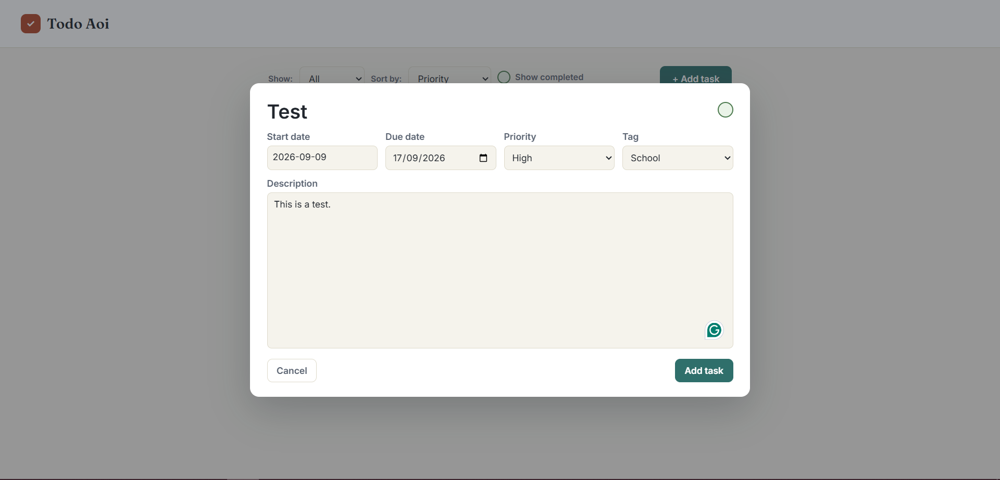
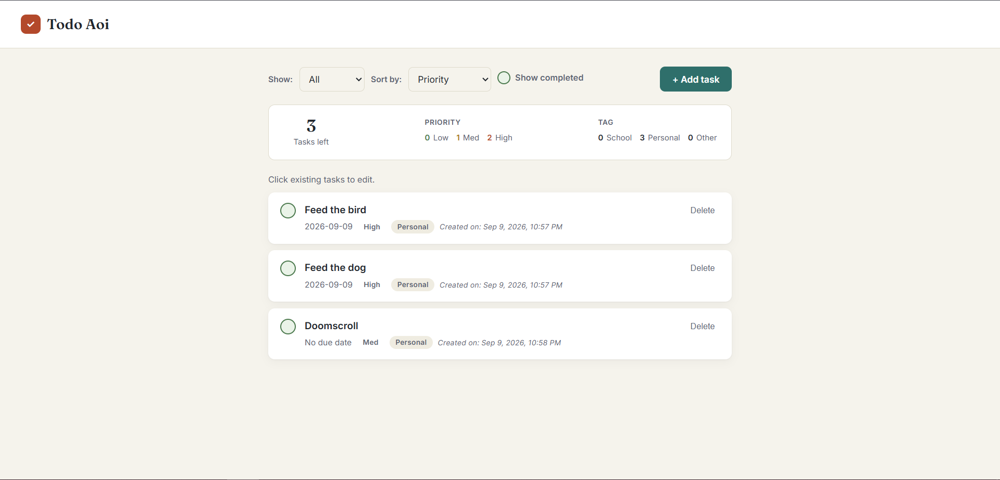
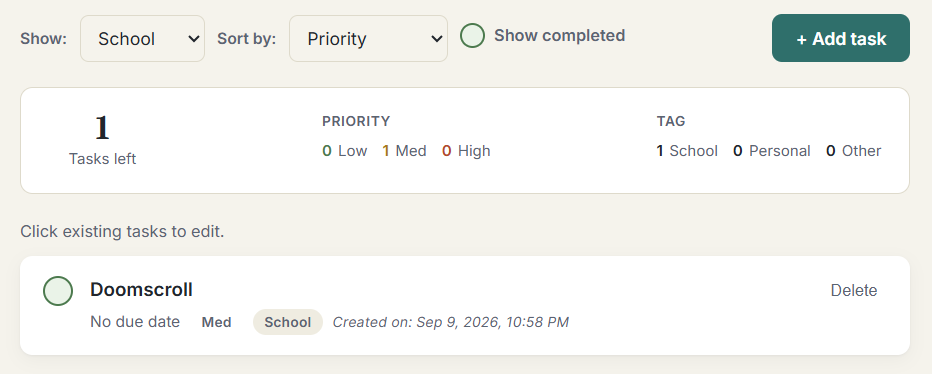
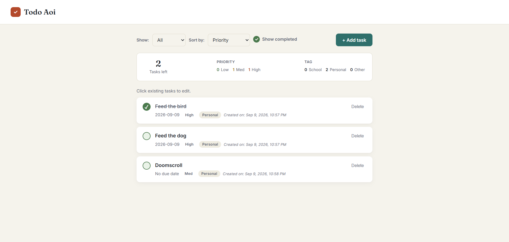

# CMSC128-CRUDToDoList
Repository for a todo list highlighting the features of CRUD in a to do list reminder

1. Tech Stack:
+ Why Javascript, HTML, CSS only?
- A simple app such as a todo list with the given freedom of writing to local storage and the cloud is perfect for a solo javascript implementation of a todo-list because it has its own data format, JSON.
+ Database - Supabase:
- Supabase is a no-brainer because it integrates with js seamlessly with a FREE TIER!
Also, because it has row level security (i.e. only specific actors can access or
change a row in a table) the public key and url doesn't need to be hidden in a .env
which requires node.js

2. API endpoints/Data operations:

- **Read tasks** - Gets all tasks for the current browser client using `fetch_tasks()` in `db_fetch.js`. The Supabase request/connection is handled by `db_connection.js`.

- **Create task** - Adds a new task with its title, description, priority, tag, due date, and completion status. The form is handled in `add_task.js`, while the database insert is handled by `insert_task()` in `db_fetch.js`.

- **Update task** - Changes an existing task's details through the edit form in `task_popup.js`. The update request is sent by `update_task()` in `db_fetch.js`, and completing or uncompleting a task is handled in `task_shortview.js`.

- **Delete task** - Removes an existing task through `delete_task()` in `delete_task.js`. The database deletion is handled by `remove_task()` in `db_fetch.js`. Undo logic
is mediated by `undo.js` before going through with `delete_task.js`.

**Task Edit/Add Popup**

**Populated Page**

**Filter/Sort**

**Completed Tasks**